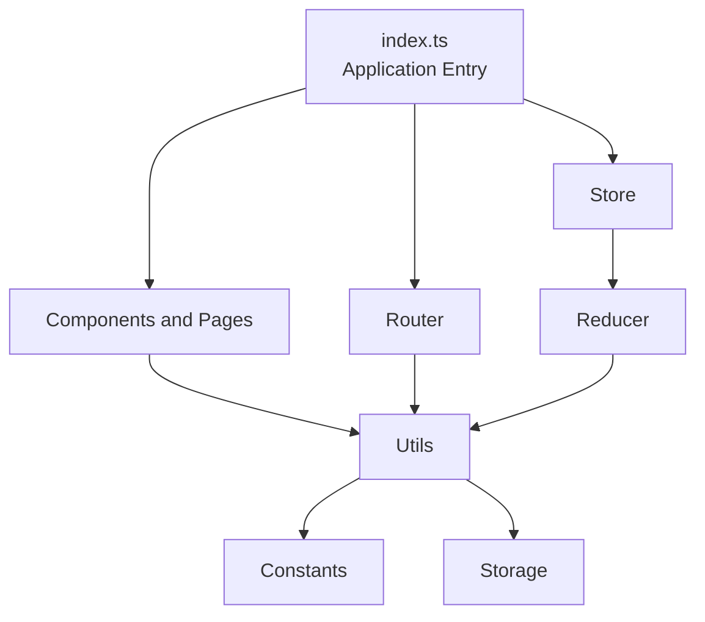

# Architecture — Phase 1 TypeScript SPA

## Overview

The project is a client-side Recipe Browser Single Page Application.

The application separates UI rendering, application state, routing, utilities, and tests into distinct modules.





## Application Layers

### 1. Entry Point

**File:** `SPA/index.ts`

The entry point initializes the application and connects the major application modules.

```text
index.ts
   │
   ├── Router
   ├── Store
   └── Page rendering
```

### 2. UI Layer

**Directory:** `SPA/components/`

The UI layer contains reusable components and page-level rendering functions.

```text
components/
├── component.ts
└── page.ts
```

`component.ts` provides reusable UI building blocks.

`page.ts` provides page-specific rendering functions.

The components use typed props and explicit DOM return types.

### 3. Routing Layer

**File:** `SPA/router.ts`

The router is responsible for:

* Matching URL paths
* Extracting route parameters
* Resolving route components
* Navigating between application pages
* Maintaining typed router state

Important types include:

```text
RouteParams
MatchResult
RouteComponent
ResolvedRoute
RouterStore
```

Route parameters are represented using:

```ts
Record<string, string>
```

This allows dynamically named route parameters while maintaining type safety.

### 4. State Layer

The state system consists of:

```text
store.ts
   │
   ▼
reducer.ts
```

#### Reducer

`reducer.ts` defines:

* Application state
* Recipe data types
* Action types
* State transitions

Actions use a discriminated union so the action type determines which payload is valid.

Conceptually:

```text
Action
├── Action A + payload A
├── Action B + payload B
├── Action C + payload C
└── Unknown action
```

#### Store

`store.ts` manages:

* Current application state
* Dispatch
* Subscriptions
* Reducer execution
* Middleware

The store uses TypeScript types for the reducer, middleware API, middleware, and dispatch flow.

### 5. Utility Layer

**Directory:** `SPA/utils/`

```text
utils/
├── constants.ts
└── storage.ts
```

`constants.ts` contains shared constants and action definitions.

`storage.ts` encapsulates browser storage operations and uses TypeScript types to describe stored values.

### 6. Testing Layer

**Directory:** `SPA/tests/`

```text
tests/
├── component.test.ts
├── page.test.ts
├── reducer.test.ts
├── router.test.ts
└── store.test.ts
```

Tests use:

* Vitest
* jsdom for DOM-based tests
* TypeScript
* Typed mocks
* DOM type narrowing

The tests verify both application behavior and TypeScript-aware implementation boundaries.

## Module Relationships

```text
                    index.ts
                       │
            ┌──────────┼──────────┐
            │          │          │
            ▼          ▼          ▼
       components    router     store
            │          │          │
            │          │          ▼
            │          │       reducer
            │          │
            └────┬─────┘
                 │
                 ▼
              utils
                 │
          ┌──────┴──────┐
          ▼             ▼
      constants      storage
```

## Path Aliases

The project uses:

```text
@utils/*
@components/*
```

TypeScript resolves these through `tsconfig.json`.

Vitest/Vite resolves them through `vite.config.ts`.

This distinction is important because TypeScript's `paths` configuration does not by itself configure Vite's runtime/module resolver.

## Testing Architecture

Vitest executes the test suite.

DOM-oriented tests explicitly use jsdom where required.

```text
Vitest
   │
   ├── Component tests
   ├── Page tests
   ├── Reducer tests
   ├── Router tests
   └── Store tests
```

Additional TypeScript exercises at the project root demonstrate:

```text
Queue<T>
ApiClient<T>
StateManager
```

These provide examples of generic and type-safe application patterns.

## Type Safety Boundaries

The major TypeScript boundaries in the application are:

```text
UI props
   ↓
Page rendering
   ↓
Router parameters
   ↓
Store actions
   ↓
Reducer state
   ↓
Storage
```

Each boundary has explicit types rather than relying on implicit `any`.

## Build / Tooling Architecture

```text
TypeScript
    │
    └── tsconfig.json
          │
          └── type checking

ESLint
    │
    └── eslint.config.mjs
          │
          └── static analysis

Vitest
    │
    └── vite.config.ts
          │
          ├── module aliases
          └── test configuration

Coverage
    │
    └── V8 coverage provider
```

## Design Goals

The architecture emphasizes:

1. Separation of responsibilities
2. Explicit TypeScript types
3. Reusable components
4. Predictable state transitions
5. Typed routing
6. Testability
7. Strict compiler checking
8. Maintainable module boundaries
